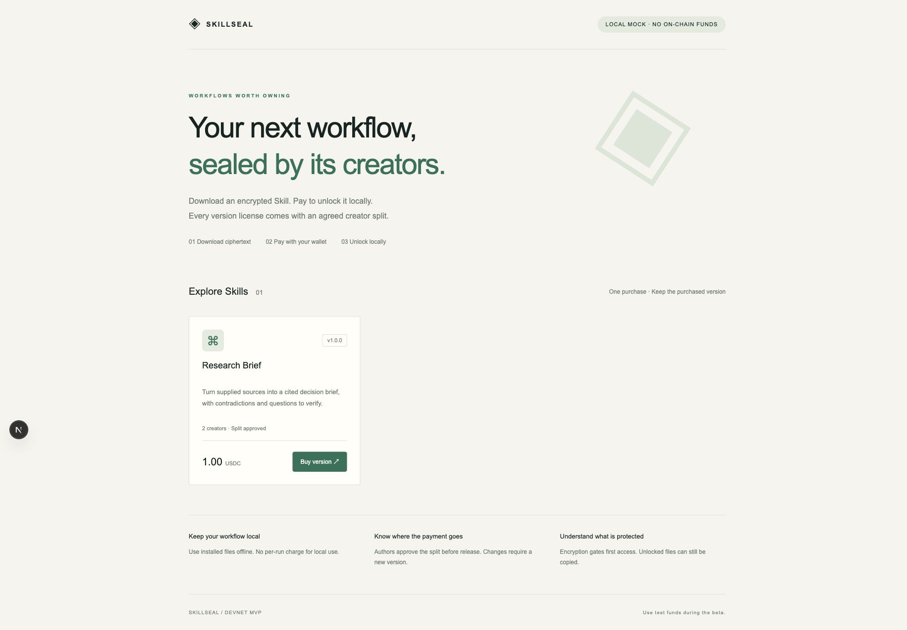

# SkillSeal

**Encrypted Agent Skills. Wallet payments. Transparent creator payouts.**

[中文说明](docs/README.zh-CN.md) · [Architecture](docs/ARCHITECTURE.md) · [Demo guide](docs/DEMO.md) · [Submission plan](docs/HACKATHON.md) · [Devnet acceptance](docs/DEVNET-ACCEPTANCE.md) · [Validation](VALIDATION.md)

SkillSeal lets Agent developers **download an encrypted Skill, pay with Solana Devnet USDC, and unlock it for local installation**. Each purchase grants permanent use of that exact version. Creators agree on fixed revenue shares before the version becomes available.



_Product screenshot from the local mock environment; no on-chain payment is shown._

```text
Download ciphertext → Sign with wallet → Pay into escrow
                    → Atomic license + creator payouts
                    → Unlock locally → Use offline
```

Solana provides settlement and a verifiable version license. AES-256-GCM and X25519 sealed boxes provide encrypted delivery. The service holds the content keys; the system cannot prevent copying after decryption or prove that a creator owns the underlying IP.

## Try it in one command

Requires **Node.js 24+ and pnpm 11**. Run from this directory:

```sh
pnpm install --frozen-lockfile
pnpm run demo
```

The Research Brief example includes a source-to-decision workflow, a review checklist, and explicitly fictional input and reference output. The isolated demo encrypts the sample Skill, signs the wallet challenge, simulates a purchase, checks a **70/30 split**, and installs the decrypted files. It needs no wallet extension, RPC, configuration, or test tokens, and cleans up its temporary data.

**This is a local mock ledger, with no on-chain transactions.**

## Run the marketplace and installer

```sh
pnpm run setup --mock
pnpm run seed
pnpm run dev
```

Open <http://127.0.0.1:3000>. In a second terminal:

```sh
pnpm run cli list
# Replace VERSION_ID with the active version ID printed above.
pnpm run cli install VERSION_ID \
  --demo-wallet .data/demo-buyer.json \
  --destination ./skills/research-brief
```

Install again into a new directory with the same buyer to demonstrate recovery without a second payment. The mock backend is restricted to loopback development. Initialization never overwrites existing keys.

For browser purchases, the page downloads `skillseal-session.json`, which contains ciphertext and a separate decryption private key. After payment, install with:

```sh
pnpm run cli resume --session /path/to/skillseal-session.json \
  --destination ./skills/research-brief
```

The session file is private. Never commit it.

## What is implemented

| Capability         | Implementation                                                               |
| ------------------ | ---------------------------------------------------------------------------- |
| Immutable versions | Signed manifest, encrypted bundle hash, fixed price and license              |
| Author consent     | Every author approves; up to five authors; shares total 10,000 bps           |
| Settlement         | Anchor escrow accepts the fixed Devnet USDC amount                           |
| Grant and payout   | One atomic transaction records the license and pays the authors              |
| Key delivery       | Durable sealed box preparation; release after `finalized` state verification |
| Recovery           | Wallet challenge binds a fresh X25519 key to an existing version license     |
| Refund             | Original buyer can reclaim an unsettled payment after 600 seconds            |
| Local installation | Authenticated decryption, safe paths, no overwrite, no script execution      |
| Observability      | Completion, unlock latency, failures, transaction fees and account rent      |

No platform commission in the MVP. New versions require a separate purchase. NFT, TEE, mainnet funds, metered local usage, plagiarism detection and live traditional payment integration are outside the MVP.

## Why Solana?

The initial users already have wallets and value direct stablecoin receipts and publicly verifiable collaboration splits. A traditional payment provider could deliver the same encrypted files and could also support splits. Both approaches have the same limitations after a buyer decrypts the Skill.

The experiment is whether wallet settlement and shared creator revenue improve this audience's buying experience. Compare the full cost of a purchase, including account rent, RPC and on/off ramps. See the [payment comparison](docs/README.zh-CN.md#solana-与传统支付的选择).

## Project structure

```text
skillseal/
├── app/           Next.js marketplace, checkout and API routes
├── cli/           Publish, approve, install, resume and refund commands
├── src/           Encryption, bundle validation, key vault and payment adapters
├── anchor/        Anchor escrow, author approval and permanent version licenses
├── scripts/       Setup, sample publishing, settlement worker and isolated demo
├── tests/         Cryptography, recovery, payment protocol and security tests
├── examples/      A complete sample Skill package
├── docs/          Bilingual runbook, architecture, demo and submission materials
└── .github/       CI, bug report and pull request templates
```

TypeScript · Next.js · Node.js · SQLite · libsodium · Solana · Anchor/Rust.

The v1 wire format and Anchor crate keep their original `skill-vault` identifiers for protocol compatibility. The project and product name is **SkillSeal**.

## Validate and deploy

```sh
pnpm run format:check
pnpm run typecheck
pnpm run test
pnpm run build
pnpm run demo
```

The compiled SBF contract has passed two local ProgramTest integration tests with real SPL token transfers. **A public Devnet deployment and wallet-extension purchase are still pending.** The public faucet failed during the initial validation; no public program address or transaction is presented as completed evidence. See [VALIDATION.md](VALIDATION.md).

Use a fresh clone for `pnpm run setup` without `--mock`, then follow the [Devnet runbook](docs/README.zh-CN.md#solana-devnet). The checked-in program address is a bootstrap identifier, not a deployed endpoint; setup generates your own program identity.

## Preparing a public release

[PUBLISHING.md](docs/PUBLISHING.md) covers the repository description, topics, release archive and submission checklist. The platform source and bundled demo example are available under the [MIT license](LICENSE). Creator-published Skill packages may use separate per-version terms. The demo purchase exercises test payment and delivery; the public example itself remains MIT licensed.

Read [CONTRIBUTING.md](CONTRIBUTING.md) and [SECURITY.md](SECURITY.md) before working on the payment or key-delivery paths.
