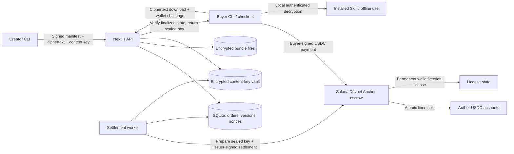

# SkillSeal architecture

SkillSeal controls the first delivery of a version's decryption key, records a wallet's purchase and distributes revenue to approved authors. Local use after installation has no runtime payment dependency.

## Components

The worker and API share one local database and key vault in this single-instance MVP. Payment adapters isolate settlement from delivery; the implemented adapters are Solana and an explicitly labelled local mock. A live traditional-payment adapter is future work.

## Lifecycle and authority

```mermaid
stateDiagram-v2
  [*] --> created: Ciphertext downloaded; X25519 key created
  created --> bound: One-time wallet challenge verified
  bound --> funded: Finalized fixed-price USDC escrow payment
  funded --> granted: Persist envelope; atomic license + splits; verify finalized
  funded --> refunded: Original buyer; at least 600 seconds since payment
  bound --> granted: Same wallet already owns this version
  granted --> [*]: Return envelope and install locally
  refunded --> [*]
```

SQLite stores workflow progress. It does not establish payment authority. The Solana adapter rereads program-owned, derived accounts at `finalized`, validates version, mint, buyer, issuer and price, then permits delivery. A supplied transaction hash alone never unlocks content.

The chain's order and grant are scoped to one buyer/version. Retries reuse that state instead of charging again. After a grant, a new order session and signed challenge can bind another encryption key without redistributing revenue. An unsettled refund permits a later fresh payment; a granted order cannot use the timeout refund path.

## Cryptography

- **Package:** deterministic JSON file container; mandatory nonempty root `SKILL.md`; at most 500 files and 10 MiB of original content.
- **Content encryption:** random 32-byte key and AES-256-GCM nonce; SHA-256 binds the encrypted bundle to the immutable manifest.
- **Key custody:** the content key is encrypted under a separate master key, with the version ID bound as authenticated data.
- **Buyer identity:** an Ed25519 wallet signature over an origin-bound, order-bound, expiring one-time challenge.
- **Buyer delivery:** a separate X25519 key pair and libsodium sealed box. Browser wallet private keys are never exported or converted into encryption keys.
- **Installation:** verify the ciphertext digest and GCM tag; validate every path; write to staging and rename into a new destination. No package script runs during installation.

Signed messages, bundle format tags, AES authenticated-data strings and the Anchor crate retain the v1 `skill-vault` namespace. These are protocol constants, not display branding. Changing them requires an explicit compatibility strategy.

## Chain contract

`anchor/programs/skill-vault/src/lib.rs` implements immutable version registration, author approval, fixed-price escrow funding, issuer-authorized settlement and buyer-authorized timeout refund. The mint is fixed to Circle's Solana Devnet USDC.

Each version includes the issuer, price, content/manifest identity and fixed author shares. Every participating author must approve before a purchase. Settlement atomically writes the permanent license and transfers escrowed tokens to approved author accounts. Shares round down in order; the final author receives the remainder. For 1,000,001 base units and 70/30, the payouts are 700,000 and 300,001.

Key preparation is off chain. The envelope must be durably stored before the service attempts settlement, and delivery waits for finality. This ordering supports retries after an interruption; it does not prove to the chain that the key or content is correct.

## Trust and availability

| Boundary                 | What it guarantees                                             | What it does not guarantee                                  |
| ------------------------ | -------------------------------------------------------------- | ----------------------------------------------------------- |
| Authenticated encryption | Detects ciphertext tampering or a wrong content key            | Preventing an authorized buyer from copying plaintext       |
| Wallet challenge         | Control of a wallet for that session                           | Legal identity or ownership of intellectual property        |
| Anchor settlement        | Approved split and wallet/version grant commit atomically      | Correct key delivery or Skill quality                       |
| Authorization service    | Checks finalized chain state and prepares recoverable delivery | Permissionless access if the service permanently disappears |

The issuer service can fail or provide incorrect material. A distributed database, KMS, high availability, audited upgrade governance and a production support policy are not implemented. Back up `.env.local`, the encrypted database, ciphertext and issuer identity through separate protected channels. A lost master key cannot be recovered from chain records.

## Observability

`/api/metrics` reports session completion, failures and unlock latency. Solana costs come from successful finalized payment, settlement and refund transaction history; transaction signatures deduplicate fees and account-creation rent deposits. Missing history is explicit and retried by synchronization.

These metrics exclude deployment, publication, approvals, failed transactions, RPC subscriptions and on/off ramps. Mock metrics never represent chain costs. The [validation record](../VALIDATION.md) distinguishes local behavior from public Devnet acceptance.
