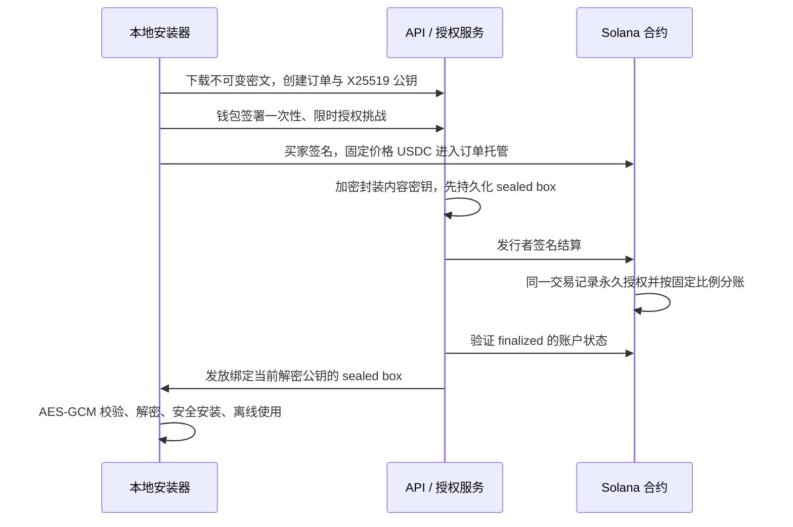

# SkillSeal：给 AI 助手装一份工作说明书

**找到好用的 Skill，装到自己的电脑；需要付费时，让创作者按约定收到收入。**

Skill 是一组可复用的说明、模板和参考文件。例如，“研究简报”Skill 告诉 AI 怎样整理你提供的资料、引用来源、检查结论。它不是一个新模型；你仍使用自己的 AI 工具。

[打开网站](https://skillseal-47-236-112-184.sslip.io/) · [产品演示](https://youtu.be/s0OTYYRy4cY) · [英文简介](../README.md)

## 它解决什么问题？

好用的 AI 工作流程经常散落在提示词链接、文件夹和聊天记录里。使用者要确认文件齐全、版本正确、安装后能找回来。创作者则需要交付、收款，并把收入分给合作伙伴。

## 怎么使用？

- **使用者：** 在网站选择 Skill，下载 ZIP 或用安装工具。免费内容不需要钱包。把文件交给自己的 AI 工具，再提供任务资料。
- **创作者：** 上传文件，设置许可与价格，合作伙伴先确认分成；审核通过后分享版本链接。
- **付费买家：** 用钱包购买所选版本。购买成功后可以恢复安装，不重复付款。付款十分钟后仍未结算，可申请退回。

## 为什么用区块链？

这里的 Solana 就是**收款、分账和购买记录系统**。测试中，1 测试 USDC 自动按 70/30 分给两位合作作者，同时记录买家获得了哪个版本的使用许可。USDC 是按美元计价的代币；这里用的是没有真实货币价值的测试币。

对本来就在用钱包的开发团队，这种记录和分账比较直接。传统支付也可以做交付和分账。自动让 AI 花钱所需的预算、权限和密钥管理，还没有做进这个版本。

## 现在能用到什么程度？

网站已上线，免费 Skill 可以直接下载。首批内容包含 Research Brief，以及保留原作者和 Apache-2.0 许可的三项 Anthropic Skill。[查看来源与安装方法](CURATED-SKILLS.md)。

购买、分账、恢复、超时退款和备份恢复已通过验收，但**收费目前仅限 Solana Devnet 测试网，没有主网收款、真实客户或收入数据**。[完整验收记录](ONLINE-ACCEPTANCE.md)。

购买者得到的是所选版本的使用许可，不是版权所有权。服务保存付费内容密钥；解密后的文件仍可被复制。独立安全审计尚未完成。

<details>
<summary>开发者操作手册：本地运行、发布、Devnet、恢复与退款</summary>

## 快速体验：本地模拟

需要 Node.js 24+、pnpm 11。以下命令在本项目目录运行：

```sh
pnpm install --frozen-lockfile
pnpm run setup --mock
pnpm run seed
pnpm run dev
```

打开 <http://127.0.0.1:3000>。另开终端：

```sh
pnpm run cli list
pnpm run cli install <list 输出的版本 ID> \
  --demo-wallet .data/demo-buyer.json \
  --destination ./skills/research-brief
```

该流程实际调用 HTTP API、下载 AES 密文、生成 X25519 密钥、签署钱包挑战、模拟 70/30 分账、领取 sealed box 并解密安装。换一个新目录再次安装，使用同一个买家钱包，无需再次付款或分账。独立演示 `pnpm run demo` 不需要初始化或启动服务。

初始化只执行一次，拒绝覆盖现有配置与密钥。独立项目目录不包含运行时配置；源码压缩包不包含 `.env.local`、`.data` 或钱包私钥。模拟模式仅允许本机开发环境，远程和生产环境会拒绝启动模拟付款。

## Solana Devnet

使用单独的干净副本，运行 `pnpm run setup`（不加 `--mock`）。它生成临时发行者钱包、程序部署钱包、随机密钥库主密钥，并同步 Rust、Anchor 配置和 `.env.local` 的程序地址。不要重复初始化现有密钥库。

合约固定接受 Circle Devnet USDC：`4zMMC9srt5Ri5X14GAgXhaHii3GnPAEERYPJgZJDncDU`，6 位小数。API、CLI 和网页交易广播会校验 Devnet genesis；不能使用主网或其他网络。测试币可从 [Circle 官方 Faucet](https://faucet.circle.com/) 获取，选择 Solana Devnet。

合约依赖固定 Anchor 0.32.2。已使用 Agave 2.3.13、SBF platform-tools 1.53 编译；旧 platform-tools 1.48 的 Rust 无法解析锁定依赖使用的 Rust 2024 edition。安装 Rust、Solana CLI 与兼容的 SBF 工具后：

```sh
cd anchor
cargo build-sbf --tools-version v1.53 --manifest-path programs/skill-vault/Cargo.toml
cd ..
solana --url devnet --keypair .data/issuer.json airdrop 2
solana --url devnet --keypair .data/issuer.json program deploy \
  --program-id anchor/target/deploy/skill_vault-keypair.json \
  anchor/target/deploy/skill_vault.so
pnpm run seed
```

部署需要足够测试 SOL，包括程序账户租金；Faucet 可能限流。`seed` 生成两位作者、测试买家和一个尚待批准的版本。付费发布要求将测试发布者地址加入 `PUBLISHER_ALLOWLIST`；如首次 seed 因未准入被拒绝，可用生成的 `.data/author-a.json` 查询公钥、配置准入后重试。运营者审核仍为默认要求，仅隔离的 loopback 测试可设置 `MODERATION_REQUIRED=0`。给 `.data/author-a.json`、`.data/author-b.json` 对应地址提供测试 SOL，然后分别签署批准：

```sh
pnpm run cli approve <版本 ID> --wallet .data/author-a.json
pnpm run cli approve <版本 ID> --wallet .data/author-b.json
pnpm run dev
```

另开终端运行 `pnpm run worker`，持续注册待发布版本、同步作者批准、处理已付款订单。购买页面的同步操作也能触发结算。买家钱包需要测试 USDC 和支付手续费、订单账户租金的测试 SOL。浏览器安装 Phantom 或 Solflare，并使用 Devnet：

```sh
pnpm run cli install <版本 ID> --destination ./skills/research-brief
```

安装器首先保存密文与私有恢复文件，然后打开购买页面。连接钱包，签署授权挑战和付款交易，等待 `finalized`；安装器随后自动解密安装。也可用专门的临时 Devnet keypair 执行 `--wallet buyer.json` 无界面测试，不能对链上付款使用 `--demo-wallet`。

## 发布、恢复与退款

发布包必须包含非空的根目录 `SKILL.md`，最多 500 个文件、10 MiB 原始内容。使用确定性 JSON 文件容器，不接受 ZIP、符号链接或危险路径。发布后作者、价格、密文摘要和许可不能覆盖；修改需要新版本。

创作者元数据示例（`price` 为最小单位，`bps` 合计 10000；最多五位作者，发布者必须是作者之一）：

```json
{
  "skillId": "research-brief",
  "name": "Research Brief",
  "description": "把资料整理成带来源的研究简报",
  "version": "1.0.0",
  "price": "1000000",
  "mint": "4zMMC9srt5Ri5X14GAgXhaHii3GnPAEERYPJgZJDncDU",
  "splits": [
    { "wallet": "作者 A 公钥", "bps": 7000 },
    { "wallet": "作者 B 公钥", "bps": 3000 }
  ],
  "license": "购买者永久本地使用所购版本；禁止重新分发原始资源。"
}
```

```sh
pnpm run cli publish --skill ./my-skill --manifest ./manifest.json --wallet author-a.json
pnpm run cli approve <版本 ID> --wallet author-b.json
```

CLI 会填入发布者、发行者和密文摘要，签署包含平台 origin 和版本摘要的批准。每位作者还必须签署链上批准，之后版本才可购买。内测不收平台佣金；向各作者向下取整，尾差进入最后一位作者账户。

付款或领取中断时保留安装器输出的 session 文件：

```sh
pnpm run cli resume --session .data/sessions/<订单 ID>.json --destination ./skills/recovered
```

网页直接购买会先下载密文，再将密文和独立解密私钥保存到 `skillseal-session.json`，付款后使用相同 `resume` 命令。该文件含独立的解密私钥，妥善保管，安装后可删除。没有 session 时，以同一个钱包重新执行 `install`：签署新的挑战、绑定新的 X25519 公钥，已有链上授权可重新领取密钥，无需付款。所有安装目标须为尚不存在的目录，避免覆盖本地文件。

未结算订单从链上付款时间起满 600 秒，可由原买家签署退款：

```sh
pnpm run cli refund <订单 ID> --wallet buyer.json
```

已结算订单不可走超时退款。合约无法收回已解密的文件。发布提交中断时，CLI 会事先输出版本 ID；worker 会重试已保存草稿的链上注册，随后用该 ID 继续作者批准。

## 交付与信任边界



钱包使用 Ed25519 证明身份和签交易，独立 X25519 密钥用于 [libsodium sealed box](https://github.com/jedisct1/libsodium-doc/blob/master/public-key_cryptography/sealed_boxes.md)，不转换或导出浏览器钱包私钥。内容使用随机 AES-256-GCM 密钥；密钥库以独立主密钥再次加密，绑定版本 ID。客户端核对密文 SHA-256 和 GCM 认证标签。包内脚本只作为文件保存，安装时不执行。

服务保管内容密钥，因此必须信任服务能交付正确内容。合约不能证明密钥、文件质量或版权归属。链上授权证明特定钱包购买了特定内容摘要，不保证该内容原创，也不阻止解锁后的复制。SQLite 状态与客户端提供的交易哈希不能单独触发解锁，服务重新读取 `finalized` 的合约账户。

`.env.local` 的主密钥与 `.data` 的加密数据库、密文、发行者 keypair 要分别备份。丢失密钥库主密钥无法通过区块链恢复内容密钥。密文和账户记录可公开，解密密钥、主密钥和 session 私钥不写入日志。发布请求含内容密钥，远程服务强制 HTTPS。发行者钱包需要持续拥有测试 SOL 来结算。

这是单实例内测：本地 SQLite、磁盘文件存储和文件密钥库，没有 KMS、分布式数据库、管理员界面或主网审计。支付适配层 `PaymentAdapter` 与授权服务分离，可后续加入传统支付；本次不接入真实传统渠道。NFT、TEE、自动抄袭识别、按本地调用计费均不在范围内。

## API 与指标

| 方法       | 路径                                 | 行为                                       |
| ---------- | ------------------------------------ | ------------------------------------------ |
| GET        | `/api/config`、`/api/versions`       | 公共配置、版本目录                         |
| POST       | `/api/versions`                      | 验证发布者签名、密文与内容，保存不可变版本 |
| POST       | `/api/versions/:id/approve`、`/sync` | 作者批准、刷新链上状态                     |
| GET        | `/api/versions/:id/bundle`           | 无需付费的密文下载                         |
| POST       | `/api/orders`                        | 创建订单，验证 X25519 公钥                 |
| POST       | `/api/orders/:id/challenge`、`/bind` | 限时 nonce 挑战、签名绑定买家              |
| POST       | `/api/orders/:id/pay`                | 返回待买家签署的付款交易或已有授权         |
| GET / POST | `/api/orders/:id`、`/sync`           | 查询、恢复与结算                           |
| POST       | `/api/orders/:id/claim`、`/refund`   | 领取 sealed box、创建超时退款交易          |
| GET        | `/api/metrics`                       | 购买、恢复、耗时、失败及链上费用           |

`pnpm run cli metrics` 输出购买会话完成率、平均解锁耗时、发生失败的订单数量、退款数量。重复请求按事件和订单去重；重新安装是新的会话，可能计为一次新解锁，但不重复计算交易费用。

`chainCosts` 从 finalized 交易历史采集成功付款、结算和退款的交易费，以及订单、托管 ATA、作者 ATA、退款接收 ATA 的首次创建租金押金，按交易签名去重。租金与不可退手续费分别报告；当前合约保留订单与托管账户，不实现租金回收。RPC 历史缺失会标记 `ordersWithUnavailableHistory`，不妨碍领取；同步或 worker 会重试采集。指标不包含发布、批准、部署、失败交易费、RPC 服务费或入金提现成本，不能把这个数字直接视为完整商业购买成本。

## Solana 与传统支付的选择

| 维度       | Solana                                      | 传统支付                               |
| ---------- | ------------------------------------------- | -------------------------------------- |
| 适合人群   | 已有钱包与 USDC 的开发者                    | 更广泛的普通用户                       |
| 成本       | 交易费、账户租金、RPC、入金提现             | 渠道比例费、固定费与结算费；各渠道不同 |
| 收款与分账 | 钱包直接收稳定币；规则和执行公开            | 银行结算成熟；也可通过支付商做多方分账 |
| 退款与争议 | 额外退款交易，平台自建售后                  | 支付商提供退款与拒付工具               |
| 隐私与运维 | 钱包交易公开；自建合约、RPC、签名和密钥服务 | 用户信息交给平台和支付商               |
| 内容保护   | 控制首次访问，不能防止解锁后复制            | 相同的加密交付可实现相同保护           |

Solana 基础费用参见 [官方费用说明](https://solana.com/docs/core/fees) 与 [支付成本](https://solana.com/docs/payments/how-payments-work)。传统渠道的实际费率应按地区和支付方式评估，[Stripe 定价](https://stripe.com/pricing) 只是一个示例；[Stripe Connect](https://docs.stripe.com/connect/separate-charges-and-transfers) 也支持分账。首版验证钱包结算和公开分账是否有用户价值；Devnet 转化不能代表真实入金成本或真实付费意愿。

## 验证

```sh
pnpm run typecheck
pnpm run test
pnpm run build
pnpm run demo
cd anchor
cargo build-sbf --tools-version v1.53 --manifest-path programs/skill-vault/Cargo.toml
SBF_OUT_DIR="$PWD/target/deploy" cargo test --test escrow
```

TypeScript 测试覆盖密文篡改、错误密钥、危险路径、符号链接、未付款领取、伪造数据库授权、所有作者批准、钱包签名重放与过期、结算中断恢复、超时退款、再次安装和成本去重。协议测试核对 Anchor/Borsh 字段、链上所有者、价格、代币、网络与钱包交易账户。Rust 测试加载实际编译的 SBF 合约，执行真实 SPL Token 转移，验证固定分账、结算权限、原子性、重复付款/结算、作者批准和超时退款。

本地验证结果与公开 Devnet 部署状态见 [VALIDATION.md](../VALIDATION.md)。生产构建通过不等同于已部署合约或完成公开 Devnet 交易。

## 公开网站与独立安装工具

产品形态是“网站 + 独立 CLI + 支付与密钥交付 API”。网站负责解释价值、预览技能和给出安装入口；CLI 将技能安装到用户机器；付费服务负责不可变版本、作者分成、订单、解密密钥和恢复。现阶段免费 MIT 示例可独立安装，公开 Devnet CLI 购买与恢复已通过；真实超时退款和网页恢复已通过；Phantom 状态见线上验收。

执行 `pnpm run build:distribution` 会生成 `site-dist/`，包含网站、编译后的 JavaScript CLI 压缩包、带固定 SHA-256 校验的 Research Brief 示例和发行哈希清单。网站的安装页按当前地址生成可复制命令。用户仅需 Node.js 24+，不需要服务端 `.env.local`、钱包或完整源码仓库。安装后打开 `SKILL.md`，提供自己的资料，再用 `references/review-checklist.md` 检查输出。免费示例直接下载，与付费解锁验收分开记录。

GitHub Actions 在应用测试、完整生产构建、干净目录发行包安装和合约检查通过后，将网站自动发布到 GitHub Pages。Render 账户创建静态网站时要求绑卡，未创建任何服务或付费资源；持久化 API 的准备配置见 [DEPLOYMENT.md](DEPLOYMENT.md)。

区块链支付对 agent 的价值在于钱包签名接口、稳定币计价、可读取的交易回执，以及一次交易内同步写入版本许可和支付作者份额。自主花费仍需预算、授权和私钥管理，当前 MVP 尚未实现这些控制。传统支付同样可以支持交付和分账；比较时需要计入链上手续费、账户租金、RPC 和出入金成本。

## 已上线的网站与安装入口

[SkillSeal 网站](https://fangnster.github.io/skillseal/) · [新版产品演示](https://youtu.be/s0OTYYRy4cY) · [创始人介绍](https://youtu.be/R40MxhZ26mo)。需要 Node.js 24 或更高版本：

```sh
npm install --ignore-scripts -g https://fangnster.github.io/skillseal/downloads/skillseal-cli-0.2.0.tgz
skillseal sample --server https://fangnster.github.io/skillseal --destination ./skills/research-brief
```

已从公开 HTTPS 地址在干净目录验证 npm 安装、两个新目录的示例安装、已有目录拒绝覆盖，以及五个 Markdown 文件的本地读取。打开 `SKILL.md` 交给自己的 Agent，提供资料，再按 `references/review-checklist.md` 检查结果。公开示例免费且为 MIT，不需要钱包，也不会生成付费授权。公开 Devnet CLI 路径已验证；公开 HTTPS 付费 API、真实超时退款和网页恢复已通过；Phantom 状态见线上验收。

## 0.2 完整网站功能

Next.js 应用现已增加网页上传、发布预览、作者批准、审核人检查文件与上架审核、独立版本分享页、免费 ZIP 下载和 CLI 安装，以及私有 session 的网页解密恢复。免费发布可在 `PAYMENT_BACKEND=disabled` 模式下运行，不依赖 Devnet 空投或程序部署；该模式没有模拟账本，也不能产生付费授权。源码功能验收与公开阿里云上线是两项不同的状态。

- `/creators`：选择 Skill 文件夹或根 `SKILL.md`，设置版本、许可、免费/测试价格及作者分成，预览后签名发布。免费创作者可创建并保存本地身份文件，钱包私钥不上传服务器。
- `/manage`：仅配置的审核人可用一次性签名挑战检查包内容、批准或拒绝上架。
- `/skills/<版本哈希>`：分享此版本，查看许可、作者分成、审核状态及校验摘要；免费包无需钱包即可下载安装。
- `/library`：读取自己的私有恢复 session，在浏览器本地解密已购买版本，避免重复付款。

公开测试收费仍要求完成 Devnet 部署、发行者测试 SOL、创作者准入、链上作者批准与实际购买验收。真实主网收款没有启用。现有 MIT 示例仍免费且可按 MIT 许可分发。操作步骤见 [PLATFORM.md](PLATFORM.md)，阿里云部署见 [deploy/aliyun/README.md](../deploy/aliyun/README.md)。

</details>
